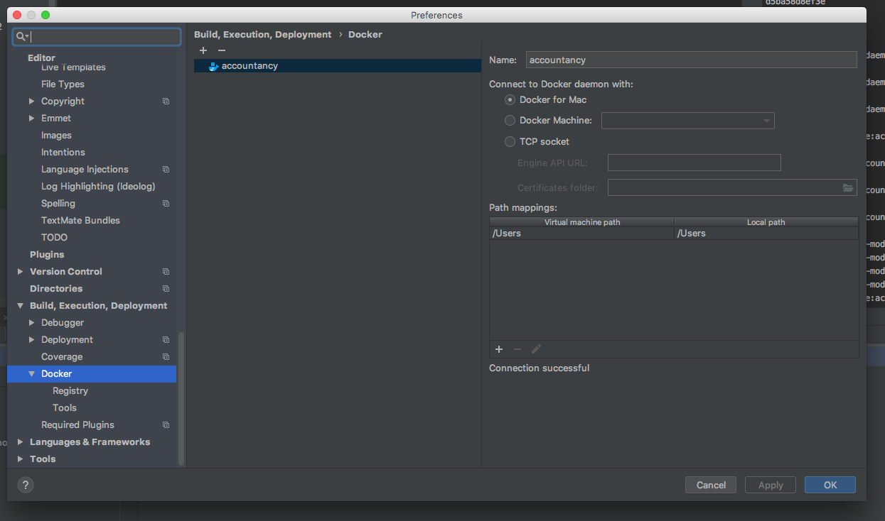
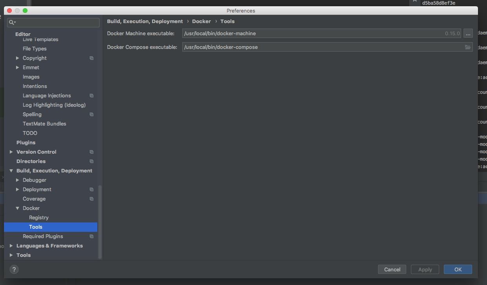
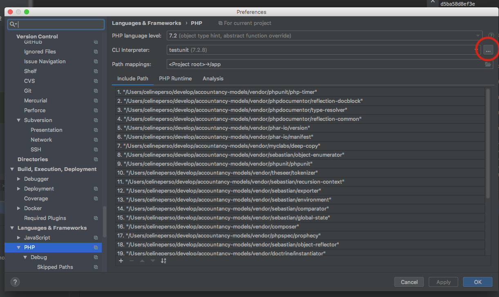
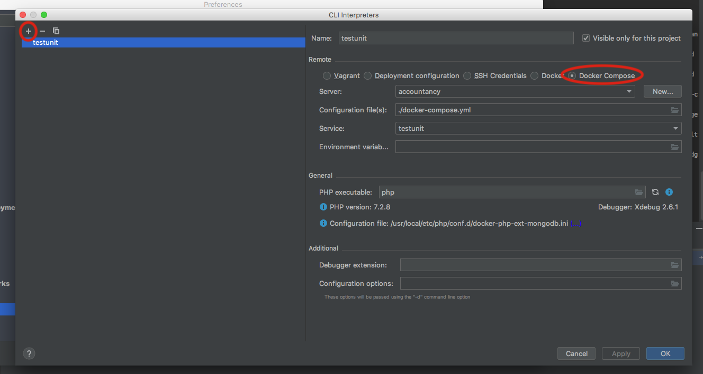
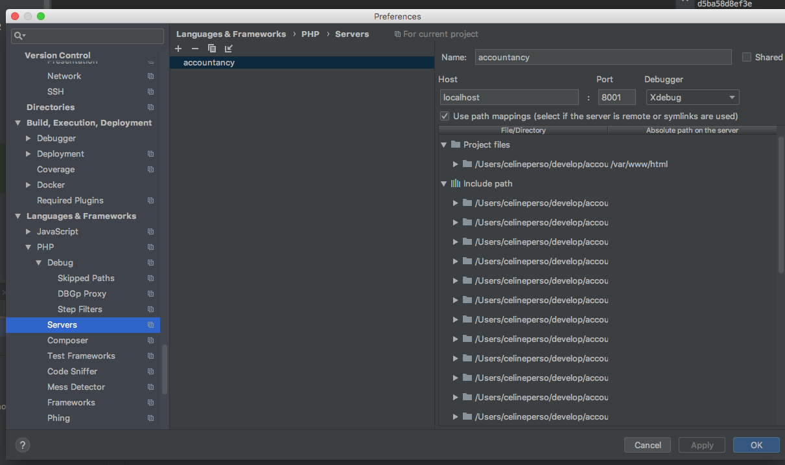
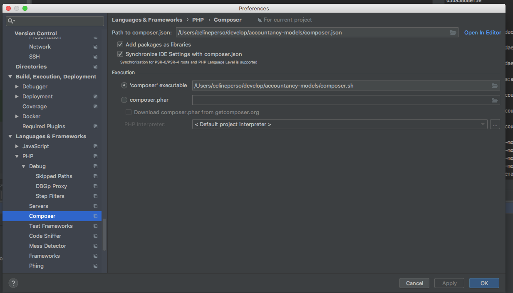
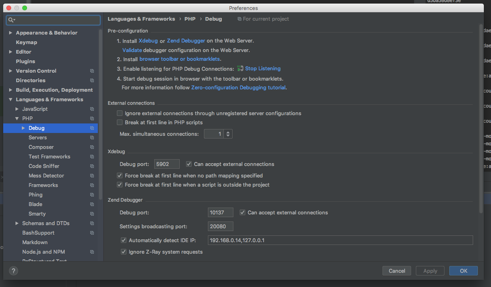

# usefull commands
docker-compose will install composer dependencies, create a container for test units, a container for database, and a local http server
````bash
docker-compose up -d
````

# configure phpstorm 






